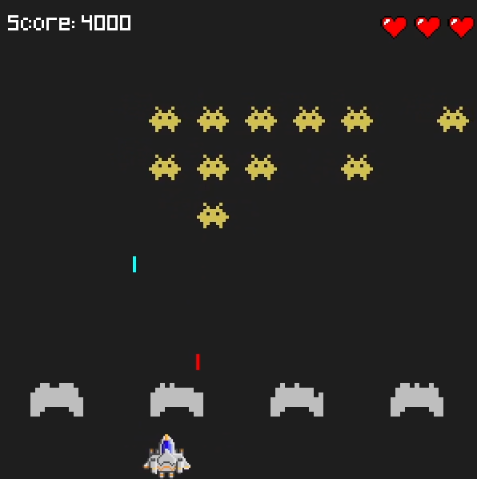

# Project Summary
This is a recreation of Space Invaders using the Pygame library. This game is the first step of many toward my goal of becoming a capable software developer through project-based learning. I wanted to create something that others enjoy playing while gaining experience creating clean and modular code. 

# How to Install
## Method 1: Download the game as an executable file
1. Download the zip file from the GitHub repository.  

- [Windows Download](https://github.com/TommyJu/space-invaders/blob/main/dist/SpaceInvadersWindows.zip)  

- [Linux Download](https://github.com/TommyJu/space-invaders/blob/main/dist/SpaceInvadersLinux.zip)

  

2. Extract the files from the zip archive into a folder.
3. Run the executable file "SpaceInvadersWindows" or "SpaceInvadersLinux".

## Method 2: Run the code yourself
1. Ensure that you have Python and Pygame installed.
2. Use Git to clone the repository to your machine.
3. Navigate to the "space-invaders" directory in your terminal.
4. Run "python3 main.py".

# How to Play
The objective of this game is to beat your high-score! Eliminate all aliens to advance to the next level. The game ends when you run out of lives, or if the aliens make it past you.
- Use *arrow keys* to move left and right.
- Press *spacebar* to shoot a laser at your enemies.

# Project Goals
- Have fun creating something that I can play and show others.
- Experiment with 2D movement, game loops, GUIs, and input handling.
- Learn about the Pygame library.
- Practice OOP fundamentals in Python.
- Develop the habit of building small and fun projects!

# Learning Summary
- Separating constants into their own modules improved readability, maintainability, and reduced coupling.
- Modularization tends to decouple code and reduce unnecessary dependencies.
- Separating related logic into different modules can create a layer of abstraction that makes code easier to understand by hiding lower-level implementation details.
- Game loops are intuitive once you understand the structure (update state, collision checks, draw to screen).
- Games present many problem solving opportunities such as movement, collision, timers, and state management.

# Image Gallery

